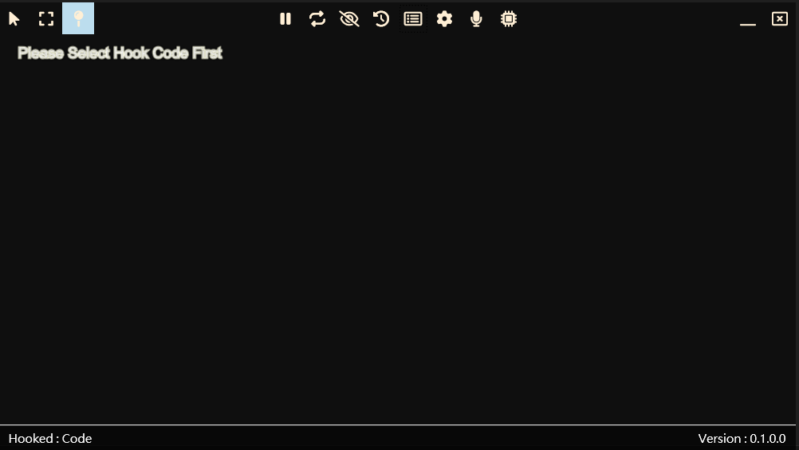

# VNGTTranslator

[繁體中文](Docs/README.zh-tw.md) | [簡體中文](Docs/README.zh-cn.md)

A visual novel game translator.

## How to Use

- Click the `Select Process` button.
- Choose either `Hook Mode` or `OCR` mode.
- If `Hook Mode` is selected, proceed to [Hook Mode](#hook-mode); otherwise, go to [OCR Mode](#ocr-mode).

### Hook Mode

- After selecting a process, click `Confirm`.
- In the main translation window, click the `Select Hook Code` button.
- Allow the game text to change.
- Select which item you will hook.
- Click `Confirm`.

> Note: Not every game can use hook mode.

### OCR Mode

- In the `Process Select Window`,
- Drag the `Drag to Target Window` item to your target window.
- Click the `Select Region` button to define the region you want to translate.
- If the image differs from your selection, try selecting `Use Screen`.
- In `Use Screen` mode, you cannot change the window position.
- Select the source language.
- Click `Save`.
